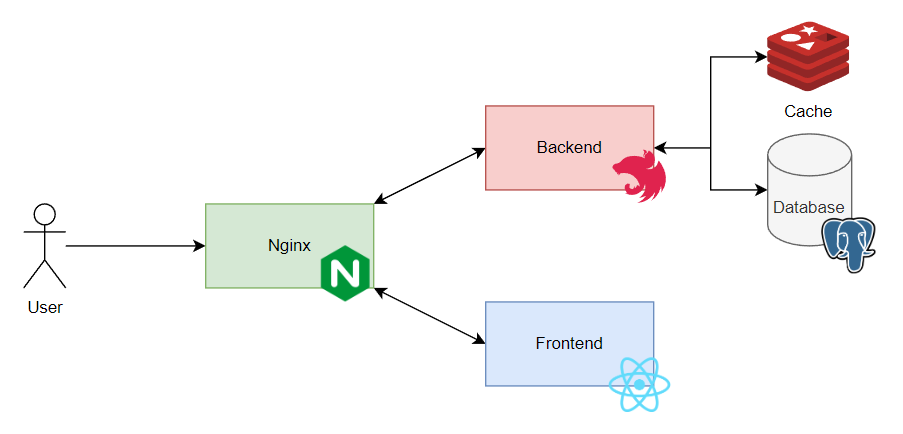

# deedni

- [Project Overview](#project-overview)
- [Installation](#installation)
  - [Repositories](#repositories)
  - [Frontend Repository](#frontend-repository)
  - [Backend Repository](#backend-repository)
- [Deployment](#deployment)
  - [Backend Deployment](#backend-deployment)
  - [Frontend Deployment](#frontend-deployment)
- [Usage](#usage)
- [Technologies Used](#technologies-used)
  - [General Technologies](#general-technologies)
  - [Backend Technologies](#backend-technologies)
  - [Frontend Technologies](#frontend-technologies)
- [API Documentation](#api-documentation)
- [Author](#author)

## Project Overview

This project is a job board application inspired on [indeed.com](https://indeed.com). Where the main goal is to allow companies to post their opening job opportunites, and the candidates to apply for them.

## Installation

### Repositories

- Clone the repository with all submodules:

```bash
git clone --recurse-submodules https://github.com/buemura/deedni.git
```

### Frontend Repository

- After cloned the repository, install all the dependencies using the commands below:

```bash
cd deedni-frontend
npm install
```

### Backend Repository

- After cloned the repository, install all the dependencies using the commands below:

```bash
cd deedni-backend
npm install
```

- Create a `.env` file in the root of the project. You can copy from `.env.example` and change the `DATABASE_URL` to a database your own.

## Deployment

### Backend Deployment

- To run the backend application in the local environment, use the command below:

```bash
cd deedni-backend
npm run docker:up
```

- This command will start the PostgreSQL, as well as 3 instances of the API and also an instance of Nginx on docker.

### Frontend

- To run the frontend application in the local environment, use the command below:

```bash
cd deedni-frontend
npm run dev
```

## Usage

- After all apps are up, go to your browser and access the URL `http://127.0.0.1:5173`.

## Features

- As a candidate you can see all the job positions available, you can also search for a specific `job title` or `location`.
- As a candidate you can apply to a job. But in order to do that you will need to login as a candidate first.
- As an employer you can add new job opportunities available
- As an employer you can see the candidates that applied to your job opportunity.
- As an employer you can change the job position status to a closed.

## Technologies Used

### Architecture Diagram



### General Technologies

- Docker
- Nginx

### Backend Technologies

- NestJS
- TypeScript
- Prisma
- PostgreSQL
- Redis

### Frontend Technologies

- ViteJS
- React
- TypeScript
- TailwindCSS
- Zustand

## API Documentation

- With backend running, you can access the URL `http://localhost:8080/api/docs` to see the Swagger API Documentation.

## Author

Bruno Hideki Uemrua

- [LinkedIn](https://www.linkedin.com/in/bruno-uemura/)
